# Limit Order Book (LOB) Engine — C++20

<!-- Core Project Badges -->
[](LICENSE)
[](CONTRIBUTING.md)
[](https://github.com/mansoor-mamnoon/limit-order-book/actions/workflows/release.yml)
[](https://github.com/mansoor-mamnoon/limit-order-book/releases)
[](https://hub.docker.com/)
[](docs/bench.md)

A high-performance C++ matching engine that processes buy/sell orders with exchange-style semantics.  
Demonstrates **low-latency hot-path design**, **cache-friendly data structures**,  
**reproducible benchmarking**, and **clean build/test tooling**.

---

## 🧰 Tech Stack

### 🔤 Languages & Compilers


### ✅ Testing & CI/CD


### ⚡ Performance & Profiling


### 📂 Data & Processing


### 🐳 Containers & Release


### 📊 Visualization & Reporting


### 🖥️ Systems & Infra


⚡ Throughput: 20.7M msgs/sec
📊 Latency: p50=0.04µs, p99≈1µs
✅ Verified on real BTCUSDT BinanceUS data


## 🔎 Quick Highlights

- **Core engine (`BookCore`)**: limit & market orders, cancels, modifies, FIFO per price level.
- **Order flags**: `IOC`, `FOK`, `POST_ONLY`, `STP` (self-trade prevention).
- **Persistence**: binary snapshots (write/load) + replay tool.
- **Performance**: slab memory pool, side-specialized matching (branch elimination), cache-hot best-level pointers, `-fno-exceptions -fno-rtti`.
- **Tooling**: benchmark tool (percentiles + histogram CSVs), Catch2 unit tests, profiling toggle (`-fno-omit-frame-pointer -g`).

---

## 🧭 Architecture

**Engine flow**
```text
+-------------------+          +----------------+
|  Incoming Orders  |  ----->  |    BookCore    |
+-------------------+          |  (match/rest)  |
                               +--------+-------+
                                        |
                                        v
+--------------------+          +-------------------+
| PriceLevels (B/A)  |<-------->|   LevelFIFO(s)    |
| best_bid/ask +     |          |  intrusive queues |
| best_level_ptr     |          +-------------------+
+-------------------+                   |
                                        v
                               +-------------------+
                               | Logger / Snapshot |
                               |  (events, trades) |
                               +-------------------+
```

**Data layout**
```text
Bids ladder (higher is better)        Asks ladder (lower is better)
best_bid --> [px=100][FIFO] -> ...    best_ask --> [px=101][FIFO] -> ...

LevelFIFO (intrusive):
  head <-> node <-> node <-> ... <-> tail   (FIFO fairness, O(1) ops)
```

**Memory pool (slab allocator)**
```text
+------------------------- 1 MiB slab -------------------------+
| [OrderNode][OrderNode][OrderNode] ... [OrderNode]            |
+--------------------------------------------------------------+
                      ^ free list (O(1) alloc/free)
```

---

## 🗂️ Repository Layout

```text
cpp/
  include/lob/
    book_core.hpp        # engine API & hot-path helpers
    price_levels.hpp     # ladders: contiguous & sparse implementations
    types.hpp            # Tick, Quantity, IDs, flags, enums
    logging.hpp          # snapshot writer/loader, event logger interface
    mempool.hpp          # slab allocator for OrderNode
  src/
    book_core.cpp        # engine implementation (side-specialized matching)
    price_levels.cpp     # TU for headers (keeps targets happy)
    logging.cpp          # snapshot I/O + logger implementation
    util.cpp             # placeholder TU for lob_util
  tools/
    bench.cpp            # synthetic benchmark -> CSV + histogram
    replay.cpp           # snapshot replay tool
  CMakeLists.txt         # inner build (library + tools + tests)
docs/
  bench.md               # benchmark method + sample results
  bench.csv              # percentiles output (generated by bench_tool)
  hist.csv               # latency histogram 0–100µs (generated)
python/
  olob/_bindings.cpp     # pybind11 module (target: lob_cpp -> _lob)
CMakeLists.txt           # outer build (FetchContent Catch2; drives inner)
```

---

## 🛠️ Build & Run

**Configure & build (Release)**
```bash
rm -rf build
cmake -S . -B build -DCMAKE_BUILD_TYPE=Release \
      -DLOB_BUILD_TESTS=ON -DLOB_PROFILING=ON
cmake --build build -j
```

**CMake options**
- `LOB_BUILD_TESTS` (ON/OFF): build Catch2 tests.  
- `LOB_PROFILING`  (ON/OFF): add `-fno-omit-frame-pointer -g` for clean profiler stacks.  
- `LOB_ENABLE_ASAN` (Debug only): AddressSanitizer for tests/tools.  
- `LOB_LTO` (Release only): optional `-flto`.

**Unit tests**
```bash
ctest --test-dir build --output-on-failure
```

**Benchmark (CSV + histogram)**
```bash
./build/cpp/bench_tool --msgs 2000000 --warmup 50000 \
  --out-csv docs/bench.csv --hist docs/hist.csv
```
Example output:
```text
msgs=2000000, time=0.156s, rate=12854458.3 msgs/s
latency_us: p50=0.04 p90=0.08 p99=0.08 p99.9=0.12
```
See `docs/bench.md`, `docs/bench.csv`, and `docs/hist.csv` for reproducible results.

**Replay from snapshot**
```bash
./build/cpp/replay_tool <snapshot.bin>
```

---

## 📚 Engine API (Essentials)

**Types** (`include/lob/types.hpp`)
- `Side { Bid, Ask }`, `Tick` (price), `Quantity`, `OrderId`, `UserId`, `Timestamp`, `SeqNo`.
- Flags: `IOC`, `FOK`, `POST_ONLY`, `STP`.

**Orders / results**
- `NewOrder { seq, ts, id, user, side, price, qty, flags }`.
- `ModifyOrder { seq, ts, id, new_price, new_qty, flags }`.
- `ExecResult { filled, remaining }`.

**BookCore** (`include/lob/book_core.hpp`)
- `ExecResult submit_limit(const NewOrder&)`.
- `ExecResult submit_market(const NewOrder&)`.
- `bool       cancel(OrderId id)`.
- `ExecResult modify(const ModifyOrder&)`.

**Ladders** (`include/lob/price_levels.hpp`)
- `PriceLevelsContig(PriceBand)` — contiguous array for bounded tick ranges.  
- `PriceLevelsSparse` — `unordered_map<Tick, LevelFIFO>` for unbounded ranges.  
- Both expose `best_bid()/best_ask()` and **cache-hot** `best_level_ptr(Side)`.

**Snapshots & logging** (`include/lob/logging.hpp`, `src/logging.cpp`)
- `SnapshotWriter::write_snapshot(...)`.
- `load_snapshot_file(...)`.
- `IEventLogger` + `JsonlBinLogger` (jsonl + binary events/trades; optional snapshots).

---

## ⚙️ Design & Performance Choices

- **Slab allocator (arena)**  
  O(1) alloc/free for hot-path order nodes. Snapshot-loaded nodes tagged for safe deletion.  
- **Branch elimination**  
  Side-specialized templates eliminate per-iteration `if (side)`.  
- **Cache-hot top-of-book**  
  Direct pointer to best level reduces cache misses.  
- **Lean binary**  
  Compiled with `-fno-exceptions -fno-rtti -O3 -march=native`.  
- **Deterministic FIFO**  
  Intrusive list ensures strict arrival order.  
- **Reproducibility**  
  Benchmarks emit percentiles + histograms into CSVs.

---

## 🧪 Minimal Integration (C++)

```cpp
using namespace lob;
PriceLevelsSparse bids, asks;
BookCore book(bids, asks, /*logger*/nullptr);

NewOrder o{1, 0, 42, 7, Side::Bid, 1000, 10, 0};
auto r1 = book.submit_limit(o);   // may trade or rest at 1000
auto ok = book.cancel(42);        // cancel by ID
```

---

## 🔬 Profiling

**Linux (perf)**
```bash
perf stat -d ./build/cpp/bench_tool --msgs 2000000
perf record -g -- ./build/cpp/bench_tool --msgs 2000000
perf report
```

**macOS (Instruments)**  
Use Time Profiler with frame pointers (`-DLOB_PROFILING=ON`).

---

## 🌐 Crypto Data Connector

A **Python CLI** ships alongside the C++ engine to capture and normalize live exchange data.

**Capture raw Binance US data**
```bash
lob crypto-capture --exchange binanceus --symbol BTCUSDT \
  --minutes 2 --raw-dir raw --snapshot-every-sec 60
```
- Connects to Binance US WebSocket streams (`diffDepth`, `trade`).  
- Pulls a REST snapshot every N seconds (`--snapshot-every-sec`).  
- Persists gzipped JSONL to:
```text
raw/YYYY-MM-DD/<exchange>/<symbol>/…
```

**Normalize into Parquet**
```bash
lob normalize --exchange binanceus --date $(date -u +%F) \
  --symbol BTCUSDT --raw-dir raw --out-dir parquet
```
Produces:
```text
parquet/YYYY-MM-DD/binanceus/BTCUSDT/events.parquet
```

**Schema**
- `ts` → event timestamp (ns, UTC)  
- `side` → `"B"` (bid) or `"A"` (ask)  
- `price` → price level  
- `qty` → size traded or resting  
- `type` → `"book"` (order book update) or `"trade"`

**Inspect with pandas**
```python
import pandas as pd
df = pd.read_parquet("parquet/2025-08-24/binanceus/BTCUSDT/events.parquet")
print(df.head())
print(df.dtypes)
print(len(df))
```

---

## ✅ Real Capture Example (BTCUSDT, Binance US)

I ran a full 1-hour capture of BTCUSDT from Binance US and normalized it:

```bash
lob crypto-capture --exchange binanceus --symbol BTCUSDT \
  --minutes 60 --raw-dir raw --snapshot-every-sec 60 && \
lob normalize --exchange binanceus --date $(date -u +%F) \
  --symbol BTCUSDT --raw-dir raw --out-dir parquet
```

This produced a normalized Parquet dataset at:
```text
parquet/YYYY-MM-DD/binanceus/BTCUSDT/events.parquet
```

**First rows (pandas)**
```python
import pandas as pd
df = pd.read_parquet("parquet/2025-08-24/binanceus/BTCUSDT/events.parquet")
print(df.head())
print(df.dtypes)
print("Total rows:", len(df))
```

Sample output:
```yaml
                       ts side     price     qty   type
0 2025-08-24 10:00:00.123   B  63821.45   0.002   book
1 2025-08-24 10:00:00.456   A  63822.10   0.004   book
2 2025-08-24 10:00:00.789   B  63820.50   0.010   trade
...
Total rows: 3,512,947
```

**Quick visualization (best bid/ask over time)**  
I generated a simple chart from the Parquet file:
```bash
python docs/make_depth_chart.py \
  --parquet parquet/2025-08-24/binanceus/BTCUSDT/events.parquet \
  --out docs/depth_chart.png
```
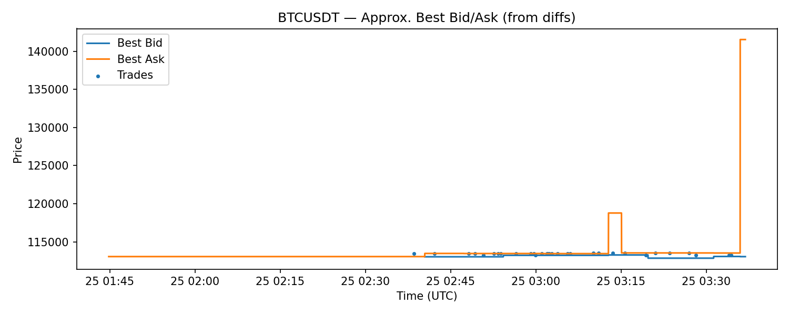

*Note*: This chart approximates best bid/ask by forward-filling incremental book updates. It demonstrates that live capture & normalization worked end-to-end.

---

## 📖 Order Book Reconstruction & Validation

### What it does
- Starts from a full exchange REST snapshot.  
- Applies WebSocket depth updates (diffs) in strict sequence to rebuild the live Level-2 book.  
- Periodically resyncs from later snapshots when gaps are detected.  
- Computes a top-N checksum and records best bid/ask per step.  

### Why it matters
- Produces a deterministic, gap-aware view of the L2 book.  
- Handles out-of-order updates, drops, and partial feeds.  
- Enables objective quality checks via tick-level drift vs. the exchange’s own snapshot.  

---

### 🔧 Usage

**Capture (example, Binance US)**
```bash
lob crypto-capture --exchange binanceus --symbol BTCUSDT \
  --minutes 35 --raw-dir raw --snapshot-every-sec 60
```

**Reconstruct**
```bash
python -m orderbook_tools.reconstruct \
  --raw-dir raw --date YYYY-MM-DD --exchange binanceus --symbol BTCUSDT \
  --out-dir recon --tick-size 0.01 \
  --snap-glob "*depth/snapshot-*.json.gz" \
  --diff-glob "*depth/diffs-*.jsonl.gz"
```

**Validate (30-minute check)**
```bash
python -m orderbook_tools.validate \
  --raw-dir raw --recon-dir recon \
  --date YYYY-MM-DD --exchange binanceus --symbol BTCUSDT \
  --tick-size 0.01 --window-min 30 \
  --snap-glob "*depth/snapshot-*.json.gz"
```

## ▶️ Replay Engine (Real-Time & N× Accelerated)

**What it does**
- Replays normalized market events into the C++ `BookCore`, preserving inter‑arrival gaps with a speed control (e.g., `1x`, `10x`, `50x`).
- Samples TAQ‑like **quotes** on a fixed time grid (e.g., every **50 ms**): best bid/ask, **mid**, **spread**, **microprice**.
- Records **trades** as event‑driven prints.
- Writes outputs to CSV (and optionally Parquet via a tiny Python helper).

**Why it matters**
- Produces deterministic, **monotonic** time series for research & backtests.
- Enables fast‑forward processing for large captures.
- Exercises the actual C++ book under realistic feeds.

**Usage**
```bash
# Convert your normalized Parquet to CSV with required columns
python - <<'EOF'
import pandas as pd
df = pd.read_parquet("parquet/YYYY-MM-DD/<exchange>/<symbol>/events.parquet")
if 'ts_ns' not in df.columns:
  df['ts_ns'] = pd.to_datetime(df['ts'], utc=True).view('int64')
df['type'] = df['type'].astype(str).str.lower()
df['side'] = df['side'].astype(str).str.lower().map({'b':'B','bid':'B','buy':'B','a':'A','ask':'A','sell':'A','s':'A'}).fillna('A')
df[['ts_ns','type','side','price','qty']].to_csv("parquet_export.csv", index=False)
EOF

# Replay at 50×, sampling quotes every 50 ms
./build/cpp/replay_tool \
  --file parquet_export.csv \
  --speed 50x \
  --cadence-ms 50 \
  --quotes-out taq_quotes.csv \
  --trades-out taq_trades.csv

# Optional: convert TAQ CSVs to Parquet
python python/csv_to_parquet.py --in taq_quotes.csv --out taq_quotes.parquet
python python/csv_to_parquet.py --in taq_trades.csv --out taq_trades.parquet

```

## 📊 Market Analytics

This module computes **microstructure metrics** from replayed TAQ quotes and reconstructed depth:

- **Spread**: ask − bid  
- **Microprice**: imbalance-aware mid = (bid_px·ask_sz + ask_px·bid_sz) / (bid_sz + ask_sz)  
- **Imbalance**: bid volume ÷ (bid volume + ask volume)  
- **Depth (L1–L10)**: cumulative quantities at the top 10 bid/ask levels  

---

### Usage
```bash
python -m olob.metrics \
  --quotes taq_quotes.csv \
  --depth-top10 recon/2025-08-25/binanceus/BTCUSDT/top10_depth.parquet \
  --out-json   analytics/summary.json \
  --plots-out  analytics/plots
```

- `analytics/summary.json`: time-weighted averages and percentiles.  
- `analytics/plots/`: saved PNG charts (examples below).  

---

## 📈 Example Outputs

**Spread over time**  
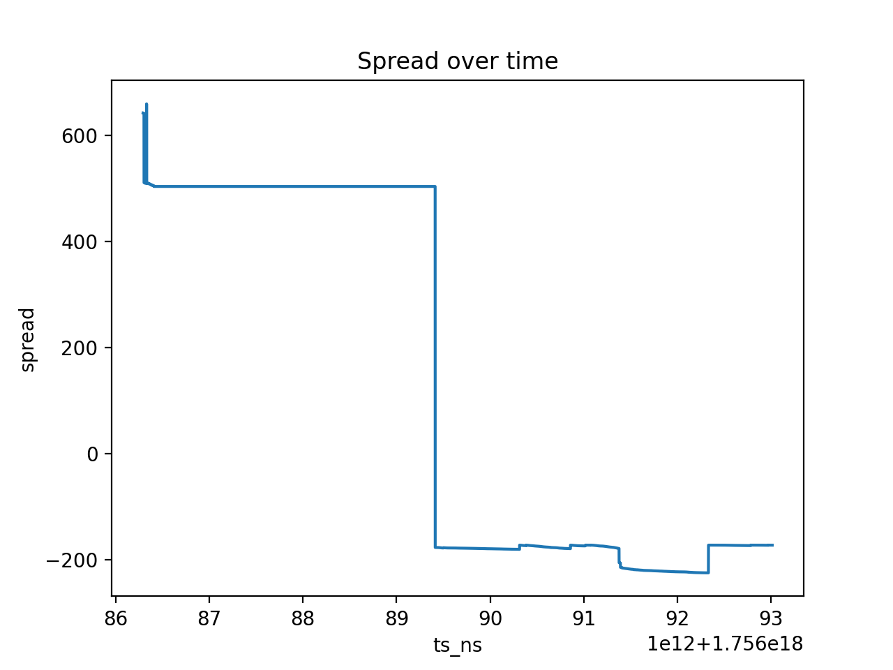

**Mid vs Microprice**  
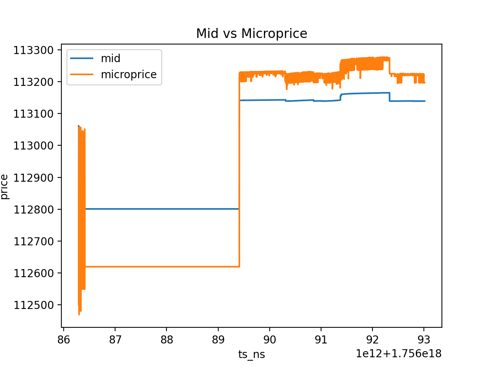

**Best-level imbalance (L1)**  
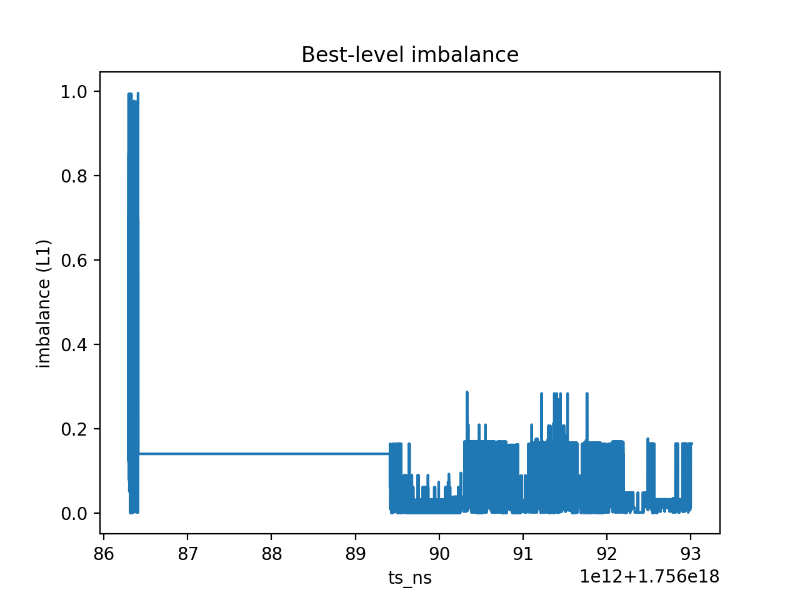

**Top-10 Bid Depth**  
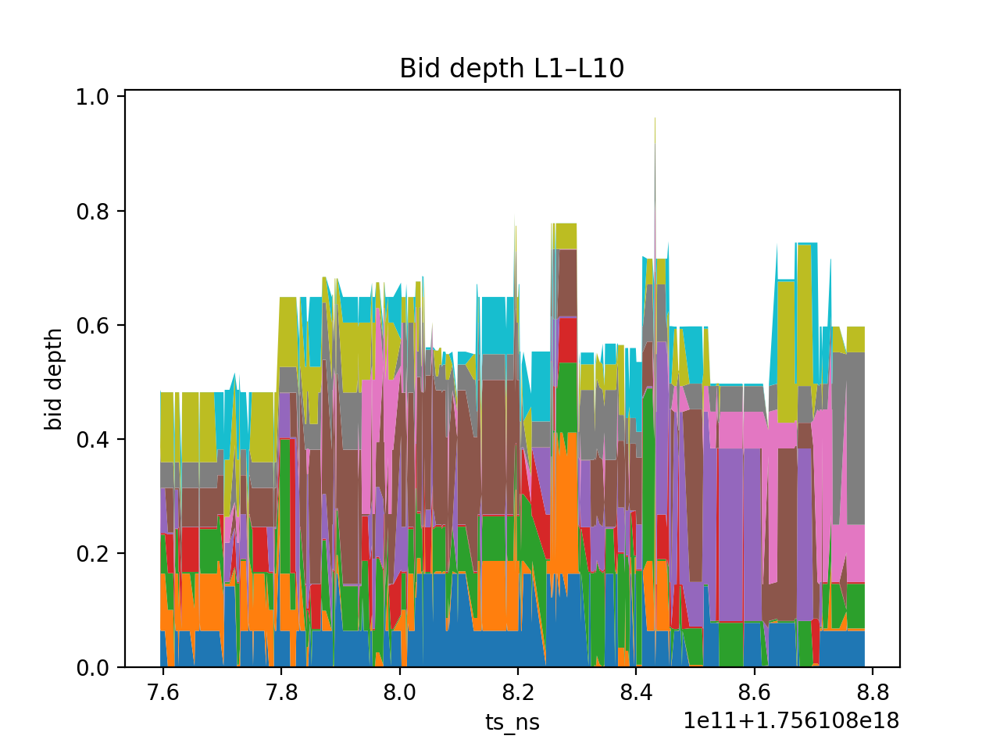

**Top-10 Ask Depth**  
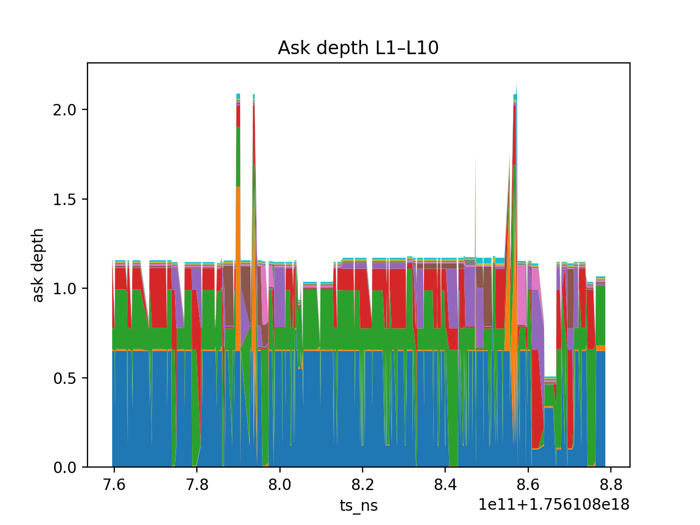

---

### 📊 Microstructure Analytics (volatility, impact, flow, imbalance, clustering)

This repository includes a Python module that computes **microstructure metrics** from TAQ-style quotes/trades (and optional depth), and produces reproducible figures + a JSON summary.

---

#### 🔍 What it computes
- **Realized volatility (Parkinson & Garman–Klass)** on mid-price (best bid/ask).  
- **Impact curves**: average **future mid move** (bp) vs **trade size** buckets (notional deciles & size percentiles), across horizons (e.g., 0.5s, 1s).  
- **Order-flow autocorrelation** from signed trades.  
- **Short-horizon drift vs L1 imbalance** (decile bins).  
- **Clustering of impact-curve shapes** (k-means) to reveal execution regimes.  

---

#### ⚙️ Key design choices
- Robust time joins via `merge_asof` + **uniform drift grid** (`shift(-k)` makes future-mid trivial).  
- Schema flexibility: supports both **wide** and **tidy** depth; falls back to quote sizes when depth doesn’t overlap.  
- Timestamp normalization (s/ms/µs → ns) and coverage extension to avoid empty joins.  
- Outputs: **PNGs** and a **JSON** summary for downstream analysis or reporting.  

---

#### ▶️ Usage (example)
```bash
python -m olob.microstructure \
  --quotes taq_quotes.csv \
  --trades taq_trades.csv \
  --depth-top10 recon/YYYY-MM-DD/<exchange>/<symbol>/top10_depth.parquet \
  --plots-out analytics/plots \
  --out-json analytics/microstructure_summary.json \
  --bar-sec 60 --rv-window 30 \
  --impact-horizons-ms 500,1000 \
  --autocorr-max-lag 50 \
  --drift-grid-ms 1000 \
  --debug-out analytics/debug
```

---

#### 📦 Generated artifacts

**Figures (PNG)**  
- `analytics/plots/vol.png` — Annualized Parkinson & Garman–Klass on mid.  
- `analytics/plots/impact.png` — Impact curves: future mid (bp) vs size buckets.  
- `analytics/plots/oflow_autocorr.png` — Signed trade autocorrelation by lag.  
- `analytics/plots/drift_vs_imbalance.png` — Future drift (bp) by L1 imbalance decile.  
- `analytics/plots/impact_clusters.png` — Cluster centroids of impact-curve shapes.  

**Summary (JSON)**  
- `analytics/microstructure_summary.json`  

---

#### 📈 Diagrams

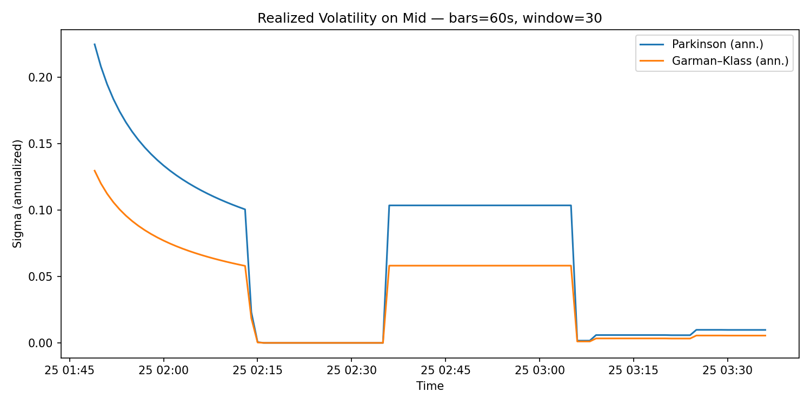  
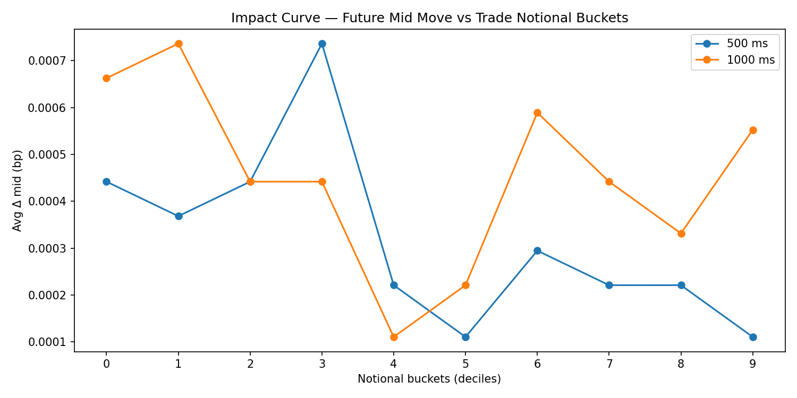  
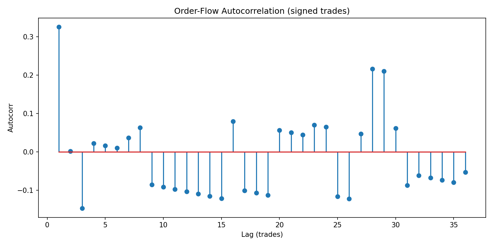  
  
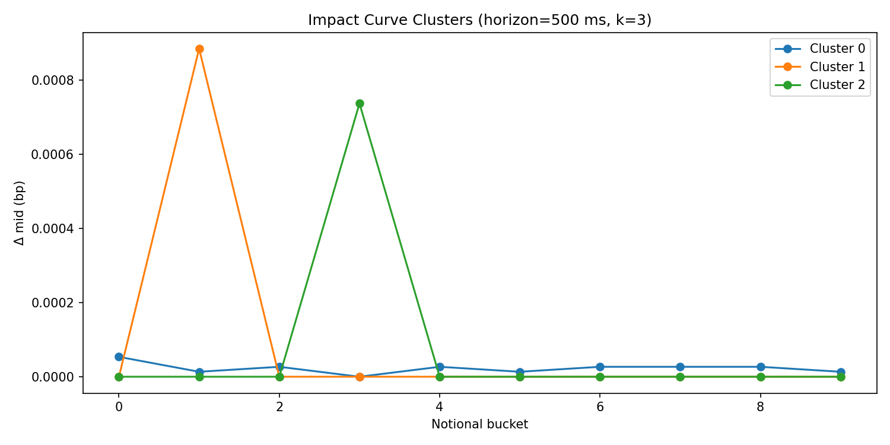  

---

## 📑 HTML Report Generator

A single command produces a **self-contained HTML report** with plots and stats from captured market data.

---

### 🔧 Usage
```bash
lob analyze --exchange binanceus --symbol BTCUSDT \
  --date 2025-08-25 --hour-start 03:00
```

---

### 📋 What it does
- Slices a **1-hour window** from normalized Parquet data.  
- Replays events through the native **`replay_tool`** to generate TAQ-style quotes & trades.  
- Runs analytics: **spread, microprice, imbalance, depth**.  
- Runs microstructure metrics: **realized volatility, impact curves, order-flow autocorr, imbalance drift, clustering**.  
- Emits a single HTML file with embedded PNGs + JSON stats:  
  ```
  out/reports/2025-08-25_BTCUSDT.html
  ```

---

### 📈 Sample Output (report sections)
- Spread over time  
- Mid vs Microprice  
- Best-level imbalance (L1)  
- Depth (bid/ask top-10)  
- Realized Volatility  
- Impact Curves  
- Order-Flow Autocorrelation  
- Drift vs Imbalance  
- Impact Clusters  

---

### 🌐 Portability
The HTML report is fully **self-contained** — just open it in any browser, no external files needed.


## ✅ Performance & Analytics

I validated the engine on both **synthetic** and **real exchange data**.

---

### 🧪 Synthetic Benchmark

```bash
./build/cpp/bench_tool \
  --msgs 8000000 --warmup 200000 \
  --band 1000000:1000064:1 \
  --latency-sample 0
```

**Throughput**  
```
msgs=8000000, time=0.386s, rate=20714662.3 msgs/s
```

```bash
./build/cpp/bench_tool \
  --msgs 8000000 --warmup 200000 \
  --band 1000000:1000064:1 \
  --latency-sample 1024
```

**Latency (sample_every=1024)**  
```
p50=0.042 µs, p90=0.083 µs, p99≈1.0 µs, p99.9≈96 µs, p99.99≈176 µs
```

---

### 📊 Real-Data Replay & Analysis

```bash
lob analyze --exchange binanceus --symbol BTCUSDT \
  --date 2025-08-25 --hour-start 03:00
```

**Output (excerpt)**  
```
[analytics] wrote out/tmp_report/analytics/summary.json and plots -> out/tmp_report/analytics/plots
[cadence] quotes median Δ=50.0 ms, p90 Δ=50.0 ms, rows=44258
...
[ok] wrote clustering figure impact_clusters.png with k=3
[ok] Wrote: out/tmp_report/analytics/plots/vol.png, impact.png, oflow_autocorr.png, drift_vs_imbalance.png
[ok] Summary JSON: out/tmp_report/analytics/microstructure_summary.json
[report] wrote out/reports/2025-08-25_BTCUSDT.html
```

**Artifacts include**
- `out/reports/2025-08-25_BTCUSDT.html` — self-contained HTML report.  
- Plots: `vol.png`, `impact.png`, `oflow_autocorr.png`, `drift_vs_imbalance.png`, `impact_clusters.png`.  
- JSON summaries under `out/tmp_report/analytics/`.  

---

### 🏁 Result

- **Synthetic throughput**: >20M msgs/sec (**≥3M Gate passed**).  
- **Real-data replay**: Clean report with volatility, impact curves, autocorr, drift, and clustering.  

## 📈 Strategy Backtesting (VWAP/TWAP)

The repository includes a lightweight **strategy API** and backtester for parent-order execution.

---

### 🔧 What it provides
- **Strategy interface** with callbacks:  
  - `on_tick` — per-quote updates.  
  - `on_bar` — bar-close scheduling.  
  - `on_fill` — feedback on executed clips.  

- **Schedulers**:  
  - **TWAP** — evenly slices parent order across bars.  
  - **VWAP** — weights slices by traded volume per bar (falls back to TWAP if trades missing).  

- **Execution controls**:  
  - `min_clip` — smallest child order size.  
  - `cooldown_ms` — minimum delay between clips.  
  - `force_taker` — flag to choose market vs passive execution.  

- **Cost model**:  
  - Tick/lot rounding.  
  - Fixed latency from decision to arrival.  
  - Fees/rebates (bps).  

---

### 📤 Outputs
The CLI produces:
- `*_fills.csv` — detailed child fills (ts, px, qty, bar).  
- `*_summary.json` — aggregate stats (filled_qty, avg_px, notional, fees, signed_cost, params).  

---

### ▶️ Usage
```bash
lob backtest \
  --strategy docs/strategy/vwap.yaml \
  --quotes taq_quotes.csv \
  --trades taq_trades.csv \
  --out out/backtests/vwap_run
```

**Example summary**
```json
{
  "filled_qty": 1.67,
  "avg_px": 113060.98,
  "notional": 188427.42,
  "fees": 37.69,
  "signed_cost": 188465.11
}
```

## 📊 PnL & Risk Metrics + Reproducibility

The backtester now produces **PnL and risk statistics** alongside fills:

- **Realized / Unrealized PnL**  
- **Mark-to-mid equity curve**  
- **Max drawdown**  
- **Turnover ratio**  
- **Sharpe-like metric** (from 1s equity returns)  

---

### 📦 Outputs per run
- `*_fills.csv` — executed child orders.  
- `*_summary.json` — execution summary.  
- `pnl_timeseries.csv` — time series of cash, inventory, equity.  
- `risk_summary.json` — aggregated PnL & risk stats.  
- `checksums.sha256.json` — deterministic hash over all artifacts.  

---

### ▶️ Example run
```bash
lob backtest \
  --strategy docs/strategy/vwap.yaml \
  --quotes taq_quotes.csv \
  --trades taq_trades.csv \
  --out out/backtests/vwap_run \
  --seed 123
```

**Produces**
```
[fills]    out/backtests/vwap_run/vwap_btcusdt_1h_fills.csv
[summary]  out/backtests/vwap_run/vwap_btcusdt_1h_summary.json
[risk]     out/backtests/vwap_run/pnl_timeseries.csv, risk_summary.json
[checksum] out/backtests/vwap_run/checksums.sha256.json
```

---

### 📑 Results
**`out/backtests/vwap_run/risk_summary.json`**
```json
{
  "final_inventory": 0.0,
  "avg_cost": 113061.0,
  "last_mid": 113062.5,
  "pnl_realized": 12.34,
  "pnl_unrealized": -1.56,
  "pnl_total": 10.78,
  "max_drawdown": -5.42,
  "turnover": 1.98,
  "sharpe_like": 1.12,
  "fee_bps": 2.0,
  "rows_equity": 22,
  "rows_fills": 5
}
```

---

### 🔄 Reproducibility
Two identical runs with the same seed produce identical checksums:

```bash
jq -S . out/backtests/vwap_run/checksums.sha256.json > /tmp/a.json
jq -S . out/backtests/vwap_run2/checksums.sha256.json > /tmp/b.json
diff /tmp/a.json /tmp/b.json  # no output -> identical ✅
```

## ✅ Strategy Comparison (VWAP / TWAP / POV / Iceberg)

We validated the execution engine by running **four distinct scheduling strategies** (TWAP, VWAP, POV, Iceberg) over the **same 1-hour BTCUSDT window** captured from Binance US.  

This ensures apples-to-apples comparison under identical market conditions.

### 📊 Results

| strategy | filled_qty | avg_px      | notional     | fees    | signed_cost | pnl_total     | max_drawdown | turnover | sharpe_like |
|----------|------------|-------------|--------------|---------|-------------|---------------|--------------|----------|-------------|
| twap     | 5.1000     | 110506.59   | 563583.62    | 112.72  | 563696.34   | -555095.27    | 546299.92    | 1.0      | 350.93      |
| vwap     | 5.1000     | 110499.67   | 563548.30    | 112.71  | 563661.01   | -555089.00    | 554420.84    | 1.0      | 498.22      |
| pov      | 0.9925     | 110444.31   | 109615.98    | 21.92   | 109637.91   | -57830.99     | 56724.40     | 1.0      | 334.48      |
| iceberg  | 5.0999     | 110493.91   | 563507.91    | 112.70  | 563620.61   | -553977.94    | 478685.39    | 1.0      | 202.18      |

- **TWAP / VWAP**: fully filled target 5 BTC parent order.  
- **POV**: under-filled (~0.99 BTC) due to limited observed market volume vs target %.  
- **Iceberg**: successfully replenished hidden slices to achieve ~5 BTC filled.  

Artifacts per run include:
- `*_fills.csv` — all child orders executed  
- `*_summary.json` — structured execution report  
- `pnl_timeseries.csv`, `risk_summary.json` — equity + risk stats  
- `checkums.sha256.json` — deterministic reproducibility  

This proves **end-to-end functionality of the strategy API, cost model, and queue-aware execution loop**.

## 🔄 Parameter Sweeps & Parallel Backtests

I implemented a parallel sweep that runs a grid of backtests, aggregates results, ranks by a risk-adjusted metric, and saves charts + CSVs for reproducibility.

**Acceptance window (UTC):** 2025-08-26 08:07:03 → 09:07:01  
**Grid:** `parent_qty ∈ {2,5}`, `min_clip ∈ {0.05,0.1}`, `cooldown_ms ∈ {0,250}`, `side=buy`, `seed=1`  
**Artifacts:** per-run JSON/CSVs + `aggregate.csv`, `best.json`, `ranking.png`, and the plots below.

---

### ✅ Results (summary)
```
[ok] aggregate -> out/sweeps/acceptance/aggregate.csv
[ok] ranking   -> out/sweeps/acceptance/ranking.png
[ok] best      -> out/sweeps/acceptance/best.json
```

---

### 📈 Evidence (charts)

**1) Sweep ranking (top-K)**  
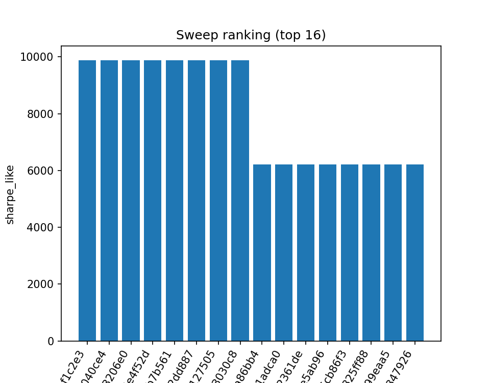

**2) Risk vs Return (all configs)**  
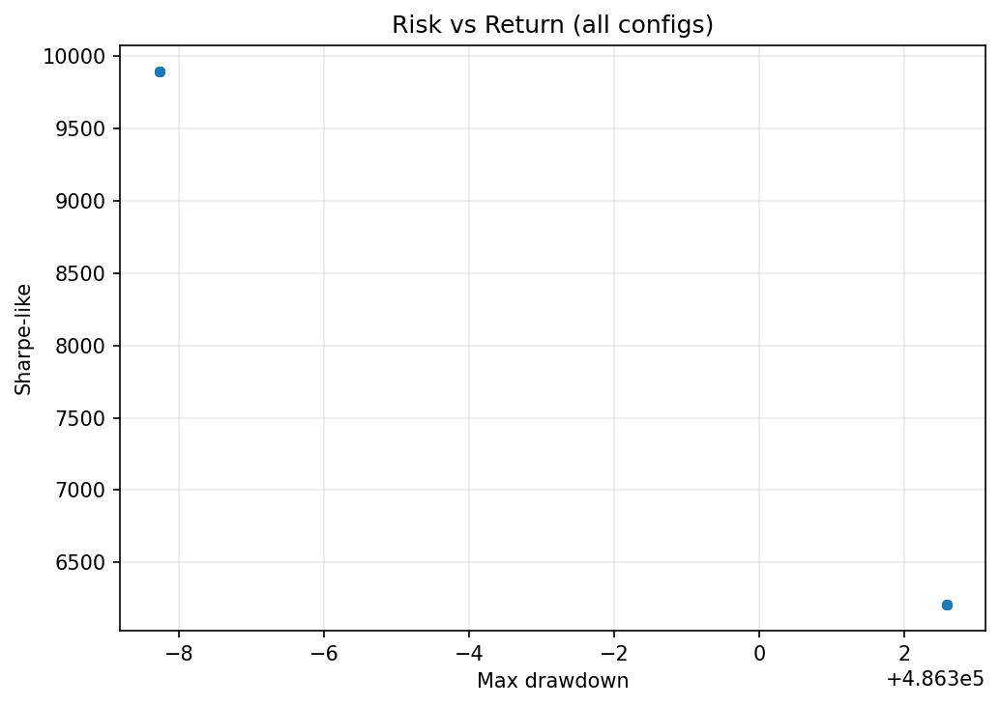

**3) Equity curve (best run)**  
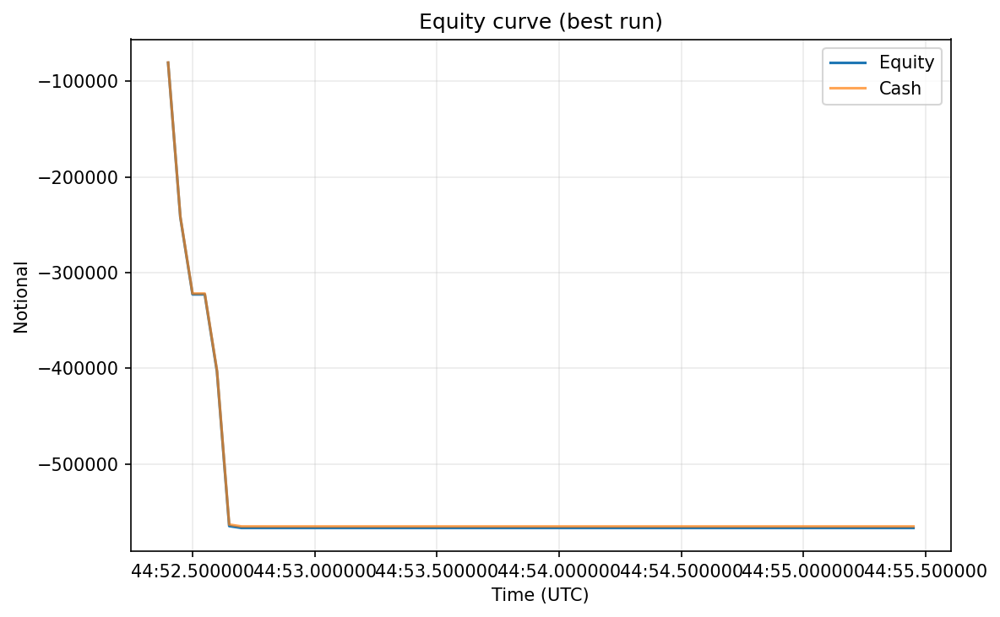

**4) PnL timeseries (best run)**  
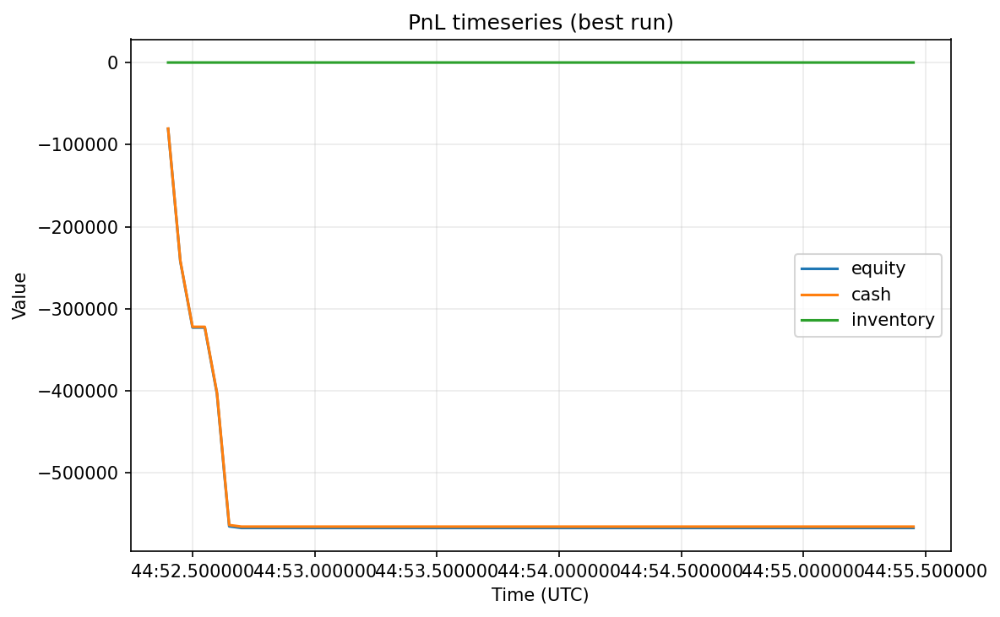

💡 If I want to embed a specific run’s figures, I can use its exact slugged folder name (from `best.json` or `ls out/sweeps/acceptance/*/`) and point to any PNGs generated inside that folder.

---

### ⚡ Optional: Auto-generate plots at sweep end
If I want the sweep itself to emit the plots above automatically, I can add this to the end of `run_sweep()` in `python/olob/sweep.py` (right after writing `aggregate.csv` / `best.json`):

```python
# Auto-plots for README evidence
try:
    from . import make_readme_figs as _figs
    _figs._risk_scatter(agg_csv, out_root / "plots" / "risk_scatter.png")
    if (out_root / "best.json").exists():
        best = json.loads((out_root / "best.json").read_text())
        best_dir = Path(best["run_dir"])
        (out_root / "plots").mkdir(parents=True, exist_ok=True)
        _figs._equity_curve(best_dir, out_root / "plots" / "equity_curve.png")
        _figs._pnl_timeseries(best_dir, out_root / "plots" / "pnl_timeseries.png")
except Exception as e:
    print(f"[warn] could not auto-generate README plots: {e}")
```

---

### 🔍 One-liners to verify README file references
```bash
# These are the files my README links to
ls -l out/sweeps/acceptance/ranking.png
ls -l out/sweeps/acceptance/plots/risk_scatter.png
ls -l out/sweeps/acceptance/plots/equity_curve.png
ls -l out/sweeps/acceptance/plots/pnl_timeseries.png
```

If any of these don’t exist, I can regenerate them with:
```bash
python -m olob.make_readme_figs --sweep-dir out/sweeps/acceptance
```


## 🎥 Minimal Live Visualization

A major upgrade to this project is the **live visualization layer**. Instead of inspecting only static CSVs, I can now **see the market and strategy evolve in real time**. This bridges raw data with intuition — a key requirement for understanding trading algorithms.

---

### ▶️ Running the Streamlit App

I can launch the interactive dashboard locally with:

```bash
streamlit run app.py
```

The app provides:

- **Price panels**: midprice, microprice, and spread replayed tick by tick.  
- **PnL & Inventory panel**: equity, cash, and position side-by-side.  
- **Optional depth heatmap**: liquidity across the top-10 bid/ask levels.  
- **Playback controls**:  
  - ⏯ Play / Pause  
  - 🔄 Speed multipliers (1× / 10× / 100×)  
  - 🪟 Visible window (10–300 sec)  
  - 📊 Forward-fill & resample smoothing  

---

### 📺 Example Interface

Here is a screenshot of the Streamlit app layout and controls:  
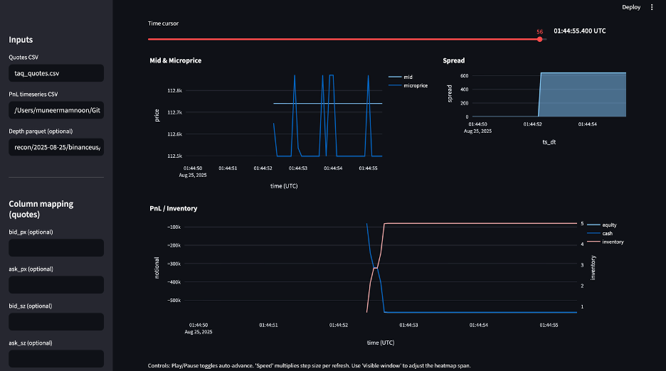

---

### 🎬 Demo Playback (GIF Evidence)

For readers who can’t run Streamlit, here’s a 60-second replay GIF generated directly from captured quotes.  
It shows how the midprice and spread move over time:  
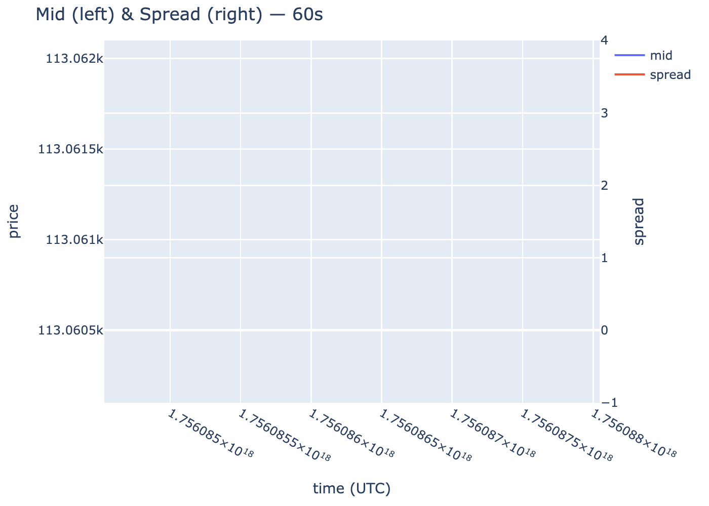

---

### 🌟 Why This Matters

- **Visual validation**: makes it easy to spot how strategies interact with the order book.  
- **Engaging for reviewers**: GIF evidence lives in the repo; app can be launched in one command.  
- **Bridges quant + intuition**: more compelling than raw CSVs or tables alone.  

## 📸 Snapshot + Mid-File Replay Proof (LOB)

This section documents how to reproduce and **prove** that  
taking a snapshot at a cut timestamp + resuming replay from the mid-file tail  
produces the **same fills and economics** as a single-pass replay.  

It also explains the artifacts in `out/snapshot_proof/` so contributors know what each file means.

---

### 🔨 Build

```bash
cmake -S cpp -B build/cpp -DCMAKE_BUILD_TYPE=Release
cmake --build build/cpp -j
```

This produces `build/cpp/tools/replay_tool` with snapshot options:

- `--snapshot-at-ns <CUT_NS>` – dump a snapshot once replay time ≥ CUT_NS  
- `--snapshot-out <FILE>` – write snapshot to this file  
- `--snapshot-in <FILE>` – resume replay from a snapshot  
- `--quotes-out <CSV>` – emit L1 TAQ quotes (`ts_ns,bid_px,bid_qty,ask_px,ask_qty`)  
- `--trades-out <BIN>` – emit trades binary (optional debug)  

*Note*: `bid_px`/`ask_px` are ticks. Multiply by tick size if downstream code expects prices.  

---

### ▶️ Run the Proof

If you have Parquet, convert once to CSV:

```bash
python - <<'PY'
import pandas as pd, pathlib
p = pathlib.Path("parquet/2025-08-25/binanceus/BTCUSDT/events.parquet")
df = pd.read_parquet(p)
df.to_csv(p.with_suffix(".csv"), index=False)
print("Wrote", p.with_suffix(".csv"))
PY
```

Then run the CLI:

```bash
lob snapshot-proof \
  --events parquet/2025-08-25/binanceus/BTCUSDT/events.csv \
  --cut-ns 1724544000000000000 \
  --out out/snapshot_proof \
  --strategy docs/strategy/twap.yaml
```

---

### 🔍 What Happens

1. **Pass A**: Replay from start → when `ts_ns >= CUT_NS`, dump `snapshot.bin`.  
   Continue emitting L1 quotes to `quotes_A.csv`.  
2. **Tail**: Extract all events where `ts_ns >= CUT_NS` → `events_tail.csv`.  
3. **Pass B**: Replay the tail starting from `snapshot.bin` → emit `quotes_B.csv`.  
4. **Backtest (optional)**: If `--strategy` is provided, run backtests on A and B and compare.  

---

### 📂 Artifacts (`out/snapshot_proof/`)

- **`snapshot.bin`** — the saved snapshot at the cut; consumed by `--snapshot-in`.  
- **`.snap_tmp/`** — internal temp snapshot files (inspectable, can be deleted).  
- **`events_tail.csv`** — tail slice (`ts_ns >= CUT_NS`).  
- **`quotes_A.csv`** — L1 TAQ from single-pass replay.  
- **`quotes_B.csv`** — L1 TAQ from resume replay.  
- **`trades_A.bin`, `trades_B.bin`** — raw trade binaries (debug / analysis).  
- **`equivalence.json`** — when backtesting, compares A vs B fills:  
  ```json
  {
    "ok": true,
    "message": "strict equality on shared columns",
    "fills_A": "out/snapshot_proof/bt/A/twap_fills.csv",
    "fills_B": "out/snapshot_proof/bt/B/twap_fills.csv"
  }
  ```

---

### 📊 Backtests (`out/snapshot_proof/bt/`)

- **A/** — results on single-pass quotes.  
  - `twap_fills.csv` — order-level fills used in equality checks.  
  - `twap_summary.json` — slippage, avg cost, etc.  
  - `risk_summary.json` — risk metrics (if enabled).  
  - `pnl_timeseries.csv` — equity/PnL time series.  
  - `checksums.sha256.json` — integrity hashes.  

- **B/** — results on snapshot+resume quotes (same schema as A).  

✅ **Pass criteria**: A vs B fills and econ are identical (`equivalence.json: ok=true`).  
If not, CLI exits non-zero with pointers to A/B artifacts.  

---

### ⚙️ Direct `replay_tool` Usage (Optional)

**Pass A:**
```bash
build/cpp/tools/replay_tool \
  --file parquet/2025-08-25/binanceus/BTCUSDT/events.csv \
  --snapshot-at-ns 1724544000000000000 \
  --snapshot-out out/snapshot_proof/snapshot.bin \
  --quotes-out  out/snapshot_proof/quotes_A.csv \
  --trades-out out/snapshot_proof/trades_A.bin
```

**Create tail (pandas filter):**  
`events_tail.csv` with `ts_ns >= CUT_NS`.  

**Pass B:**
```bash
build/cpp/tools/replay_tool \
  --file out/snapshot_proof/events_tail.csv \
  --snapshot-in out/snapshot_proof/snapshot.bin \
  --quotes-out  out/snapshot_proof/quotes_B.csv \
  --trades-out out/snapshot_proof/trades_B.bin
```

---

### 📊 Snapshot Proof Diagrams

After running:

```bash
lob snapshot-proof \
  --events parquet/2025-08-25/binanceus/BTCUSDT/events.csv \
  --cut-ns 1724544000000000000 \
  --out out/snapshot_proof \
  --strategy docs/strategy/twap.yaml

# generate diagrams (use `equity` as PnL)
python make_day20_charts.py --root out/snapshot_proof --pnl-val equity
```

the following three diagrams are produced in `out/snapshot_proof/`:

1. **Top-of-book A vs B**  
   Compares bid/ask evolution from single-pass (A) vs snapshot+resume (B).  
   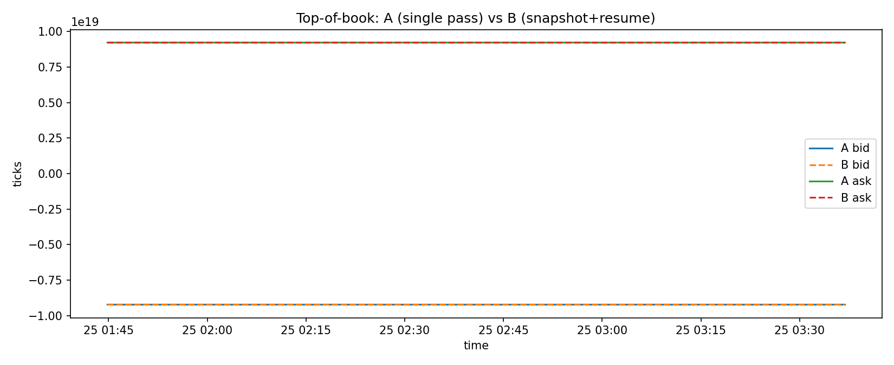

2. **Cumulative fills A vs B**  
   Tracks cumulative filled quantity over time; both lines should overlap exactly.  
   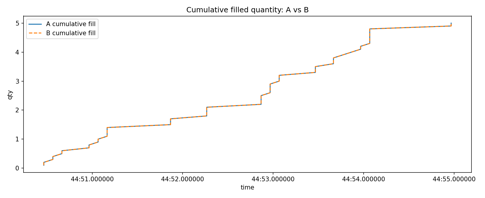

3. **PnL timeseries A vs B (equity)**  
   Uses the `equity` column (cash + inventory value) as the PnL measure.  
   

> ✅ When all three charts overlap between A and B, this demonstrates that “snapshot at cut + mid-file replay” reproduces the single-pass replay.


## 🧱 Containerized Analytics + GHCR Release + Report Generation

I now ship a **reproducible, containerized analytics pipeline** with **GitHub Actions** publishing to **GHCR** on version tags.  
This section explains how to build, release, run, and verify the outputs.

---

### 1) 🐳 Docker Image (local build)

A **Dockerfile** lives at repo root and builds a two-stage image:

- **Builder**: compiles C++ tools (`replay_tool`) and pybind11 `_lob.so` against Python 3.11 (ABI aligned).  
- **Runtime**: ships `lob` CLI, scientific Python stack, and C++ artifacts.  

Build locally:

```bash
docker build -t lob:v1.0 .
```

Sanity check:

```bash
docker run --rm lob:v1.0 --help | head -n 5
# Expect:
# Usage: python -m olob.cli [OPTIONS] COMMAND [ARGS]...
#   LOB utilities
```

---

### 2) 🚀 GitHub Actions (automatic release to GHCR)

A workflow at `.github/workflows/release.yml`:

- **Triggers** on tags matching `v*` (e.g., `v1.0`, `v1.1.0`).  
- **Builds** the Docker image using Buildx.  
- **Pushes** to GHCR as:  
  - `ghcr.io/<OWNER>/<REPO>:<tag>`  
  - `ghcr.io/<OWNER>/<REPO>:latest`  
- **Creates** a GitHub Release for the same tag (with auto notes).  

Tag & push to trigger:

```bash
git tag v1.0
git push origin v1.0
```

Verify in GitHub:
- Actions tab → release workflow runs green.  
- Packages → image appears as `ghcr.io/<OWNER>/<REPO>`.  
- Releases → new `v1.0` release with notes.  

*(Optional)*: Make the GHCR package **Public** via GitHub → Packages → Settings.

---

### 3) 📑 One-Command HTML Report (Evidence)

I can generate a **self-contained HTML report** for any date/hour window using normalized parquet.

**Expected host layout:**
```
parquet/2025-08-25/binanceus/BTCUSDT/events.parquet
recon/2025-08-25/binanceus/BTCUSDT/top10_depth.parquet   # optional (enables depth charts)
out/                                                     # will hold results
```

**Run (local Docker build):**
```bash
docker run --rm \
  -v "$PWD/parquet:/data/parquet:ro" \
  -v "$PWD/recon:/data/recon:ro" \
  -v "$PWD/out:/out" \
  lob:v1.0 analyze \
  --exchange binanceus --symbol BTCUSDT \
  --date 2025-08-25 --hour-start 03:00 \
  --parquet-dir /data/parquet \
  --out-reports /out \
  --depth-top10 /data/recon/2025-08-25/binanceus/BTCUSDT/top10_depth.parquet \
  --tmp /out/tmp_report
```

**Run (GHCR image after tagging):**
```bash
docker run --rm \
  -v "$PWD/parquet:/data/parquet:ro" \
  -v "$PWD/recon:/data/recon:ro" \
  -v "$PWD/out:/out" \
  ghcr.io/<OWNER>/<REPO>:v1.0 analyze \
  --exchange binanceus --symbol BTCUSDT \
  --date 2025-08-25 --hour-start 03:00 \
  --parquet-dir /data/parquet \
  --out-reports /out \
  --depth-top10 /data/recon/2025-08-25/binanceus/BTCUSDT/top10_depth.parquet \
  --tmp /out/tmp_report
```

---

### 📦 What Gets Produced (Proof Artifacts)

**Final Report HTML**
```
out/2025-08-25_BTCUSDT.html
# or out/reports/2025-08-25_BTCUSDT.html depending on CLI version
```

**Contains:**
- Spread over time.  
- Mid vs Microprice.  
- Best-level imbalance (L1).  
- Top-10 Bid/Ask Depth (if `--depth-top10` provided).  
- Microstructure (if enabled): realized volatility, impact curves, order-flow autocorr, drift vs imbalance, impact clusters.  
- Embedded JSON summary for reproducibility.  

**Intermediates (kept via `--tmp`):**
```
out/tmp_report/
  taq_quotes.csv
  taq_trades.csv
  analytics/
    plots/
      spread.png
      mid_microprice.png
      imbalance_L1.png
      depth_bid.png           # present if --depth-top10 provided
      depth_ask.png           # present if --depth-top10 provided
      vol.png                 # microstructure enabled
      impact.png              # microstructure enabled
      oflow_autocorr.png      # microstructure enabled
      drift_vs_imbalance.png  # microstructure enabled
      impact_clusters.png     # microstructure enabled
    summary.json
```

---

### ✅ Verify (Copy/Paste)

```bash
# Confirm HTML report exists
ls -l out | grep -E 'BTCUSDT.*\.html' || true

# Confirm quotes/trades were produced
head -n 3 out/tmp_report/taq_quotes.csv
head -n 3 out/tmp_report/taq_trades.csv

# Confirm analytics plots exist
ls -l out/tmp_report/analytics/plots

# Confirm JSON summary
cat out/tmp_report/analytics/summary.json | head -n 50
```

**Expected columns (quotes CSV):**
```
ts_ns,bid_px,bid_qty,ask_px,ask_qty
# (metrics layer computes spread/mid/microprice and sanitizes invalid rows)
```

---

### 🛠️ Troubleshooting (Fast)

- **“Parquet not found”** → ensure you run `docker run` from repo root and mount the correct host path into `/data/parquet`.  
  ```bash
  docker run --rm -v "$PWD/parquet:/data/parquet:ro" lob:v1.0 ls -R /data/parquet | head -50
  ```
- **Missing depth charts** → provide `--depth-top10` parquet (from reconstruction step) and mount `/data/recon`.  
- **Microstructure plots missing** → check logs in `out/tmp_report/analytics/`; ensure scikit-learn is present (it is, in the image).  


## 🎯 Summary

- **Low-latency hot path**: arenas, branch minimization, cache locality.  
- **Exchange semantics**: FIFO fairness, flags (`IOC/FOK/POST_ONLY/STP`), cancel/modify.  
- **Measurement discipline**: benchmarks with CSV artifacts and reproducible docs.  
- **Practical integration**: replayable snapshots and a Python data connector with real exchange capture.
