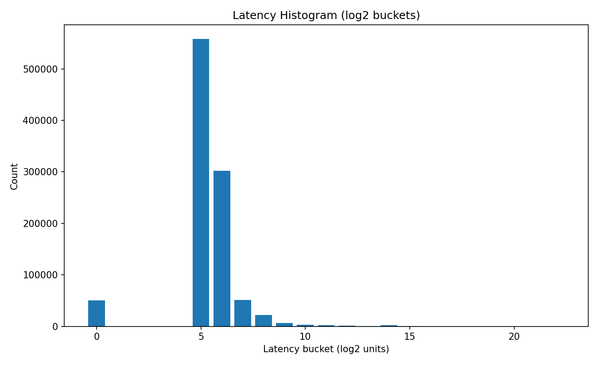
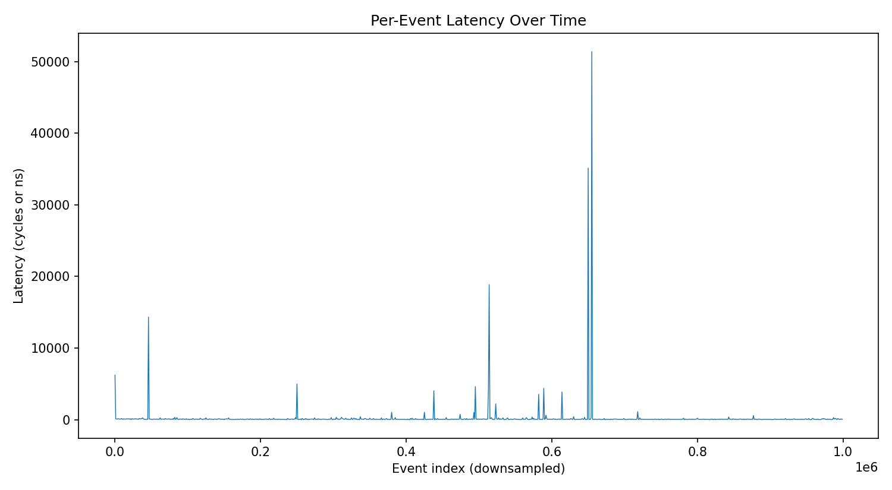

```markdown
# LOB Benchmark Report

## Summary (steady-state)
- Events total: **1000000**
- Warm-up ignored: **100000**
- Events measured: **900000**
- p50: **42 ns**
- p90: **125 ns**
- p99: **1000 ns**
- p999: **19000 ns**
- Throughput: **3.68268e+06 events_per_second**

## Environment & Methodology
- CPU: **Apple M2 Pro**
- OS: **macOS** | Compiler: **Clang 15.0.0 (clang-1500.3.9.4)** | Timing units: **ns**
- CPU pinning: **2**
- Workload knobs: Zipf(s)=**1.2**, Zipf levels=**2000**, Pareto α=**1.3**, Walk σ=**1**
- Ratios: market=**0.1**, cancel=**0.05**, modify=**0.05**, STP enabled=**1**

## Latency Histogram


## Per-Event Latency Over Time

```